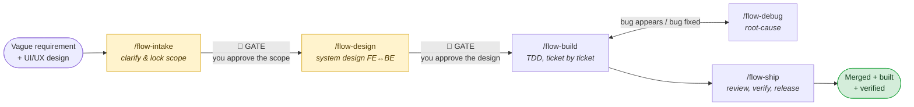

# iron-flow

**A 5-phase development pipeline for Claude Code, held together by 4 non-negotiable laws.**

iron-flow turns "here's a vague requirement, go build it" into a disciplined sequence: clarify → design →
build test-first → root-cause any bug → verify and ship. Each phase is a skill you can invoke on its own
(`/flow-intake`, `/flow-build`, …), or you can hand the whole feature to the orchestrator (`/flow`) and let it
walk the chain, stopping at approval gates along the way.

It is a **rewritten merge** of the strongest ideas from three sources — [gstack](https://github.com/garrytan/gstack)
(forcing questions, engineering review patterns, critical checklist), [mattpocock/skills](https://github.com/mattpocock/skills)
(specs, domain modeling, tracer-bullet tickets, feedback-loop debugging) and
[superpowers](https://github.com/obra/superpowers-marketplace) (hard gates, TDD, systematic debugging,
verification-before-completion) — collapsed into six self-contained skills.

**Self-contained** means: no `bun`, no calls into gstack's `bin/`, no plugin marketplace, no runtime
dependencies. Six directories of Markdown. One script installs them anywhere.

---

## Why this exists

Coding agents fail in predictable ways. They start implementing before anyone agreed what "done" means. They
write the code first and the test afterwards (so the test only proves the code does what it already does).
They see a stack trace and immediately patch the line it points at, without ever finding out why. And they
announce "all fixed!" without running anything.

iron-flow encodes the four rules that kill those four failure modes:

### The 4 Iron Laws

| # | Law | Kills |
|---|-----|-------|
| 1 | **No implementation before the design is approved.** | Building the wrong thing, beautifully. |
| 2 | **No production code before a failing test.** | Tests that rubber-stamp whatever the code happens to do. |
| 3 | **No fix before the root cause is found.** | Symptom-patching; the bug returns wearing a hat. |
| 4 | **No "done" without fresh evidence, produced in this very message.** | Confident lies. |

Every phase enforces at least one of them, and none of them are negotiable — that's the "iron" in the name.

---

## The pipeline



Plain-text version of the same thing:

```
  requirement            ┌──── bug ────┐
   + UI/UX               │             ▼
      │                  │        /flow-debug
      ▼                  │         (root cause
 /flow-intake ──GATE──► /flow-design ──GATE──► /flow-build ◄── + regression test)
  (lock scope)            (spec, contract,      (TDD, one
                           tickets)              ticket at a time)
                                                      │
                                                      ▼
                                                 /flow-ship
                                          (2-axis review → verify
                                           against design → merge/PR → build)
```

The two 🚦 gates are hard stops: iron-flow will not proceed past them without you saying yes.

---

## Install

```bash
git clone git@github.com:Pirate298/iron-flow.git ~/.iron-flow
```

Then pick a scope:

```bash
# A. Every project on this machine (user-level skills)
~/.iron-flow/install.sh
#    → ${CLAUDE_CONFIG_DIR:-~/.claude}/skills

# B. One project only (BMAD-style, committed with the repo if you want)
~/.iron-flow/install.sh --project /path/to/project
#    → <project>/.claude/skills

# C. Anywhere else
~/.iron-flow/install.sh --dir /abs/path/to/skills
```

**Open a new Claude Code session** — skills are loaded at session start, so a running session won't see them.

To update later:

```bash
cd ~/.iron-flow && git pull && ./install.sh
```

The installer copies each skill directory, rewrites its `name:` field according to `manifest.txt`, and drops a
`.iron-flow-managed` sentinel file inside. On the next run it deletes exactly the directories carrying that
sentinel — so reinstalling never clobbers skills you wrote yourself, and never leaves orphans behind when you
remove something from the manifest.

---

## Step-by-step: shipping a feature

### The short version

Type `/flow` and describe the feature. The orchestrator runs the phases in order and stops at each gate. If
you'd rather drive manually, run the six commands yourself — they work standalone and in any order you like.

### The long version

#### Step 0 — Start

```
/flow  Add a weekly progress chart to the home screen. Design is in design-ref/home-v3.png.
```

`/flow` reads the request, decides which phase to enter (a full feature starts at intake; an obvious one-line
bug jumps straight to debug), and hands off.

#### Step 1 — `/flow-intake` — turn a vague ask into a locked scope

**Input:** whatever the PO gave you — a paragraph, a Figma export, a screenshot.
**No code, no architecture happens here.**

What it does:

- **Asks one question at a time**, each with a recommended answer, each preferably multiple-choice. Asking six
  questions in one breath is how you get six half-answers.
- **Looks facts up instead of asking.** Anything discoverable in the codebase or `docs/` is not your problem to
  answer; only genuine *decisions* come to you.
- Runs up to **6 forcing questions**: who actually needs this and where does it hurt · how do they do it today ·
  name the *specific* screen and *specific* user (no generalities) · what's the narrowest slice still worth
  shipping · what are the edge cases (empty state, network error, no chart data, free vs premium) · what will
  this box us into later?
- **Pushes back.** "Users will love it" is not evidence, and iron-flow is instructed not to nod along.
- **Anchors on the UI/UX design** you provided — it is the source of truth for UI — and surfaces every place the
  written requirement and the design *contradict each other* for you to settle.
- Splits **In scope** / **NOT in scope** (written down explicitly, so it can't drift) / **Already exists, reuse
  this**.
- Offers **2–3 approaches** (at minimum a minimal-viable one and an ideal-extensible one), each with effort,
  risk, pros, cons — then **stops and makes you choose**.

**Output:** `docs/flow/<feature-slug>/intake.md`
**🚦 GATE:** nothing proceeds until you approve that document.

#### Step 2 — `/flow-design` — turn the scope into a system design

**Input:** the approved `intake.md`. It does **not** re-interview you.

What it does:

- Writes a **spec**: problem (user's words) · solution (user's words) · full user stories · implementation
  decisions · testing decisions · out of scope. Deliberately *no file paths or code* — those rot.
- Maintains the **domain model** as a living glossary in `CONTEXT.md`: each term gets a one-line definition
  plus an `_Avoid_:` list of synonyms you're banning. Opinionated on purpose — one word per concept. Writes an
  **ADR** (`docs/adr/NNNN-slug.md`) only when a decision is *hard to reverse* **and** *surprising without
  context* **and** *the result of a real trade-off*. Three conditions, all required.
- Designs for **extension**: deep modules behind small interfaces at clean seams; applies the *deletion test*
  (delete the module — does complexity vanish, or reappear in five callers?); refuses to invent a seam until
  there are two real implementations behind it.
- Reviews the architecture like an engineering manager: **blast radius**, boring-by-default, strangler-fig for
  migrations, essential vs accidental complexity — and lists every **edge case** with a test plan.
- Writes the **FE↔BE contract** explicitly: endpoints, request/response shapes, error cases, who computes what.
- Slices the work into **tracer-bullet tickets**: each one cuts *vertically* through every layer (schema → BE →
  FE → test), is independently demoable, fits in one context window, and declares which tickets block it.

**Output:** `docs/flow/<feature-slug>/design.md` + `CONTEXT.md`/ADR updates + the ticket list.
**🚦 GATE:** you approve the design before a single line is written.

#### Step 3 — `/flow-build` — implement, test-first, one slice at a time

- **Isolates the workspace** (branch or git worktree — never straight onto `main`) and checks the baseline
  suite is green *before* touching anything.
- Then, per ticket, the TDD loop — **Iron Law #2, no exceptions**:
  - **RED** — write one small test for one behavior. *Watch it fail, and check it fails for the right reason.*
    A test that passes immediately is testing the wrong thing.
  - **GREEN** — the simplest code that passes. Nothing speculative.
  - **REFACTOR** — only while green. Remove duplication; add no behavior.
  - If you catch yourself having written the code first: **delete it.** Don't keep it "for reference" — that's
    just writing the test to fit the code with extra steps.
- Tests exercise **behavior through the public interface** at agreed seams. It explicitly hunts down the three
  classic bad tests: implementation-coupled (mocking internals), tautological (asserting a recomputation of the
  expected value), and horizontal (all the tests, then all the code — should be one test, one impl, repeat).
- Independent tickets can be **dispatched to parallel agents**, then merged and run against the full suite.

**Output:** a branch where every ticket has tests and the full suite is green.

#### Step 4 — `/flow-debug` — when something breaks

Invoked automatically from build when a bug shows up, or directly (`/flow-debug the chart renders blank on
first load`) — this is also the **shortcut entry point** for an obvious one-off bug that needs no intake or
design.

**Iron Law #3 lives here: no fix before a root cause.** The phases run in order:

1. **Build a feedback loop.** *This is the actual skill.* Before anything else, get a pass/fail signal that goes
   **red on this specific bug** — failing test > curl > CLI + fixture diff > headless run > replay > temporary
   harness > bisection. Read the whole stack trace. Check `git log`/`git diff` — if it's a regression, the root
   cause is *in that diff*. **You may not proceed to step 2 without a command that reproduces the bug.**
2. **Minimize the repro** until every remaining piece is load-bearing.
3. **Hypothesize** — 3–5 falsifiable, ranked guesses *with predictions*, written down **before** testing any of
   them. Checked against a pattern table: race · nil-propagation · state corruption · integration failure ·
   config drift · stale cache.
4. **Test them.** One probe per prediction, **one variable at a time**. Every debug log is tagged `[DEBUG-xxxx]`
   so it can be grepped out in one pass later. **Three failed attempts → stop.** At that point the architecture
   is the suspect, not your hypothesis — go back to `/flow-design`.
5. **Fix.** Regression test **red first**, then fix the *root cause* (not the symptom) with a minimal diff, then
   watch it go green and run the full suite. Touching more than 5 files raises a blast-radius warning.
6. **Clean up + post-mortem.** All `[DEBUG-…]` logs gone, original repro dead, and one question answered:
   *what would have prevented this bug?*

#### Step 5 — `/flow-ship` — review, verify, release

- **Two-axis code review, run in parallel and never blended:** a **Standards** pass (repo conventions +
  the 12 Fowler code smells) and a **Spec** pass (does the diff actually match `docs/flow/<feature>/`? anything
  missing, wrong, or scope-crept? quote the spec line). Results are reported under separate headings and are
  *not* re-ranked against each other.
- **Critical checklist:** data safety, race conditions, LLM output trust boundaries, shell injection, enum/value
  completeness (grepping *outside* the diff too). Each finding carries a **1–10 confidence** score and must cite
  a real `file:line` — no citation means the confidence drops or the finding is dropped. This is the
  false-positive gate.
- **Receiving the review:** every point gets verified against the real code before being acted on. Sycophancy
  is banned outright — no "You're absolutely right!", just the fix, or a reasoned disagreement.
- **Iron Law #4 — verify before claiming done.** Each claim maps to a proof produced *in this message*: "tests
  pass" = 0 failures on a fresh run · "build works" = exit 0 · "bug is fixed" = the original symptom re-tested ·
  "regression covered" = it went red, then green · "matches the requirement" = a line-by-line checklist against
  `intake.md` and `design.md` and the UI reference. Skipping the run and asserting the result is lying.
- **Finish the branch:** with tests verified green first, you're offered exactly four options — merge locally,
  push and open a PR, keep the branch, or discard (typing `discard` to confirm).
- **Release:** produce the build, re-run E2E before shipping, and update `docs/` in the same PR whenever
  behavior changed.

---

## Re-entry and shortcuts

Real work doesn't run in a straight line, so the orchestrator handles the three common detours:

| Situation | What to do |
|---|---|
| **New feature lands mid-build** | Run a *narrowly scoped* `/flow-intake` + `/flow-design` for it, append the tickets to the existing plan, resume `/flow-build`. Do **not** wedge it into half-finished code and skip the design. |
| **Small bug with an obvious cause** | Skip intake and design. Go straight to `/flow-debug` → fix → the verify portion of `/flow-ship`. |
| **Docs or config only** | Skip the pipeline entirely. |
| **Three failed fix attempts** | Stop fixing. The architecture is wrong — go back to `/flow-design`. |

---

## Customizing

`manifest.txt` controls which skills get installed and what they're called:

```
flow            # no [area] above it → installs as /flow

[flow]
intake          # → /flow-intake
design          # → /flow-design
build           # → /flow-build
debug           # → /flow-debug
ship            # → /flow-ship
```

- Each `[area]` header opens a namespace: every skill listed under it is installed as `<area>-<skill>`.
- Lines *before* any `[area]` header keep their bare directory name.
- **Disable a skill:** comment out or delete its line, re-run `install.sh` — the sentinel cleanup removes it.
- **Add a skill:** drop a directory with a `SKILL.md` under `skills/`, list it in the manifest, re-run.
- **Add a whole new area:** open a new `[area-name]` section and list its skills. Nothing else to configure.

---

## Repo layout

```
iron-flow/
├── install.sh          # copy + prefix + sentinel cleanup. The whole install story.
├── manifest.txt        # which skills, under which [area] prefix
├── skills/
│   ├── flow/           # master orchestrator
│   ├── intake/         # phase 1
│   ├── design/         # phase 2
│   ├── build/          # phase 3
│   ├── debug/          # phase 4
│   └── ship/           # phase 5
├── dev/resync.sh       # pull the 3 upstreams into .sources/ for manual diffing
├── SOURCES.md          # upstream repos + the SHAs this fork was last synced against
└── NOTICE.md           # attribution / licensing
```

Every phase writes its artifacts under `docs/flow/<feature-slug>/` in the *target* project — `intake.md` and
`design.md` — which is what `/flow-ship` later diffs the implementation against. That directory is the paper
trail of the feature.

---

## Syncing from upstream

These skills are a merged rewrite, not a vendored copy, so there's no auto-pull. When you want to catch up:

```bash
dev/resync.sh
```

It clones/pulls the three upstream repos into `.sources/` (gitignored) and prints the commits that landed since
the SHAs recorded in [SOURCES.md](SOURCES.md). Read those commits, then hand-edit the corresponding phase. The
`<!-- sources: ... -->` footer at the bottom of every `SKILL.md` tells you exactly which upstream skills that
phase descends from, so you know where to look.

See [NOTICE.md](NOTICE.md) for attribution.
